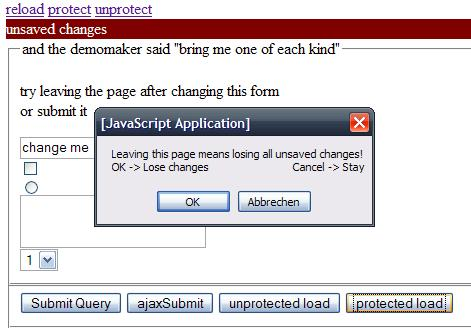

(DEPRECATED)
<h2>What it is</h2>

<p>When a user enters data into a form, it can get lost if he <strong>leaves the page or clicks a link</strong> (be it ajax or not). Here comes protectData, it <strong>asks the user before losing his data</strong> by loading another page or submitting an ajax request(optional).</p>

<p>It integrates with jquery.form (so ajaxSubmit and ajaxForm are saved too).</p>



<p>(There is a typo in the current version(thx to timothy) loose vs lose, will be fixed in 0.2)</p>

<h2>Examples</h2>

```
//basic protection
$('form').protectData(); </p>

<p>//basic and ajax protection
$('form').protectData();
$.protectData.protectAjax = true;</p>

<p>//changing defaults
$.protectData.message = "You will lose data if continuing"; //change default message
$.protectData.stateChangeCallback = function(isProtected){alert('data was changed')};</p>

<p>//making 2 requests, without being notified
$('form').protectData();
$.protectData.protectAjax=true;
$('form input').change();</p>

<p>$.protectData.unprotectAjax(2);
$.get('file.txt');
$.get('file.txt');
$('form').load('nextform.html')//user will be asked before doing this</p>

<p>//data was saved using a non-standard way(submit / ajaxSubmit / ajaxForm are integrated)
$.protectData.unprotect()
```

<h2>Demo and Testsuite</h2>

<p>Download package Test and Download (see right sidebar)</p>

<h2>Life site</h2>

<p>At the moment only used for intranet applications.
Please send me a link to your site if you use it.</p>

<h2>Works with</h2>

<p>Tested with: IE6 IE7 FF2 FF3 Opera</p>

<p>Opera does not support onbeforeunload (<a href="http://www.thescripts.com/forum/thread694783.html">explanation</a>) so you will not get a message when leaving the page</p>
